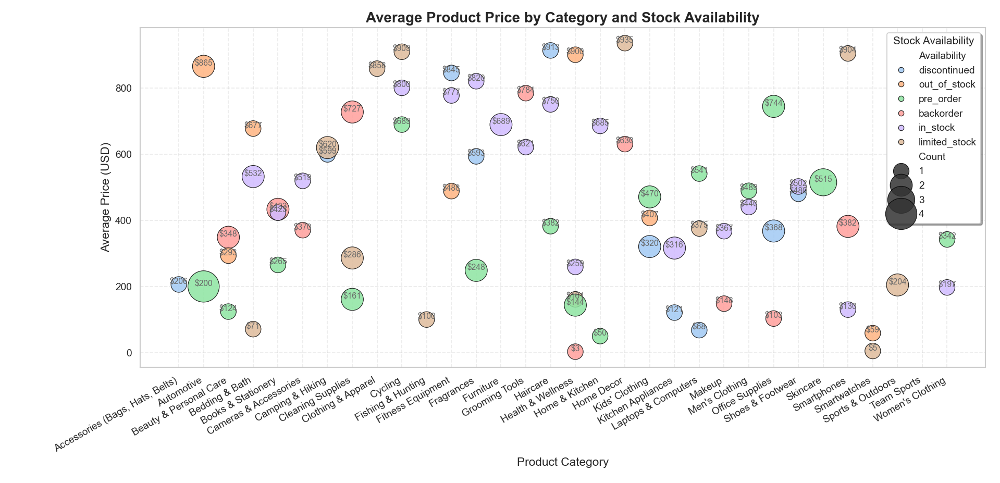

## 🛍️ Retail Visual Insights

Intelligent data visualization of product inventory using Python, Pandas, Matplotlib, and Seaborn.

### 📊 Project Overview

This project analyzes how product availability impacts average pricing across categories. The goal is to uncover actionable insights for inventory optimization, pricing strategy, and category performance.

### 🔍 Key Insights

- 💰 Identify high-value categories with strong availability
- 📦 Detect understocked categories with high pricing potential
- 📈 Visualize product distribution to support business decisions

---

### 🚀 How to Run

```bash
pip install -r requirements.txt
cd src
python visualize.py
```


### 📁 Project Structure

```
retail-visual-insights/
├── data/
│   └── products.csv
├── src/
│   └── visualize.py
├── images/
│   └── category_price_availability.png
├── README.md
└── requirements.txt
```

---

### 🧪 Technologies Used

- Python 3.10+
- Pandas
- Matplotlib
- Seaborn

---

### 📷 Sample Visualization



> The scatter plot shows average price per category, colored by availability status and scaled by product count.

---

